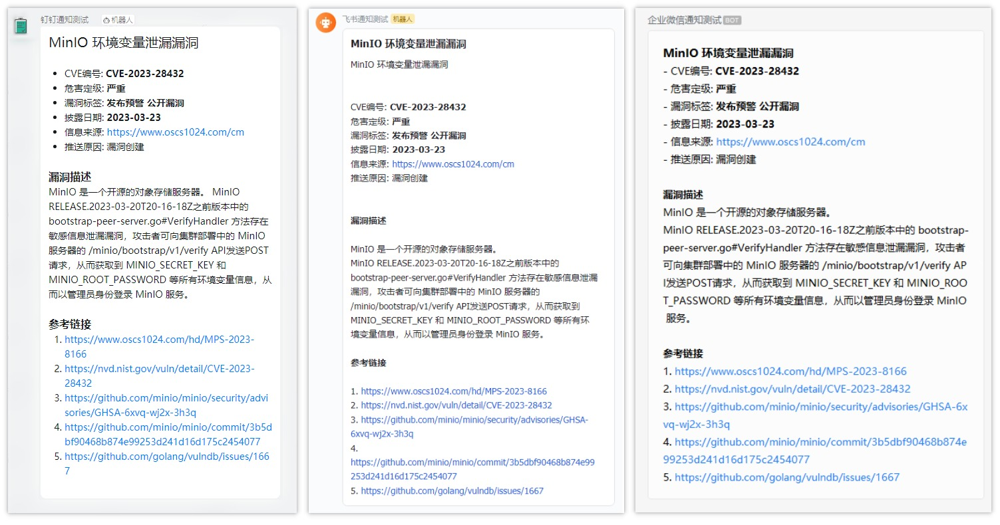

# WatchVuln 高价值漏洞采集与推送

众所周知，CVE 漏洞库中 99% 以上的漏洞只是无现实意义的编号。我想集中精力看下当下需要关注的高价值漏洞有哪些，而不是被各类 RSS
和公众号的 ~~威胁情报~~ 淹没。 于是写了这个小项目来抓取部分高质量的漏洞信息源然后做推送。 `WatchVuln`意为**监测**
漏洞更新，同时也表示这些漏洞需要**注意**。

当前抓取了这几个站点的数据:

| 名称           | 地址                                    | 推送策略                                             |
|--------------|---------------------------------------|--------------------------------------------------|
| 阿里云漏洞库       | https://avd.aliyun.com/high-risk/list | 等级为高危或严重                                         |
| OSCS开源安全情报预警 | https://www.oscs1024.com/cm           | 等级为严重**并且**包含 `预警` 标签                            |
| 奇安信威胁情报中心    | https://ti.qianxin.com/vulnerability  | 等级为高危严重**并且**包含 `奇安信CERT验证` `POC公开` `技术细节公布`标签之一 |

> 如果有侵权，请提交 issue, 我会删除相关源。
> 如果有更好的信息源也可以反馈给我，需要能够响应及时 & 有办法过滤出有价值的漏洞

具体来说，消息的推送有两种情况, 两种情况有内置去重，不会重复推送:

- 新建的漏洞符合推送策略，直接推送,
- 新建的漏洞不符合推送策略，但漏洞信息被更新后符合了推送策略，也会被推送



## 快速使用

支持下列推送方式:

- [钉钉群组机器人](https://open.dingtalk.com/document/robots/custom-robot-access)
- [微信企业版群组机器人](https://open.work.weixin.qq.com/help2/pc/14931)
- [飞书群组机器人](https://open.feishu.cn/document/ukTMukTMukTM/ucTM5YjL3ETO24yNxkjN)
- [server酱](https://sct.ftqq.com/)
- [自定义Webhook服务](./examples/webhook)

### 使用 Docker

Docker 方式推荐使用环境变量来配置服务参数

| 环境变量名                   | 说明                                         | 默认值           |
|-------------------------|--------------------------------------------|---------------|
| `DINGDING_ACCESS_TOKEN` | 钉钉机器人 url 的 `access_token` 部分              |               |
| `DINGDING_SECRET`       | 钉钉机器人的加签值 （仅支持加签方式）                        |               |
| `LARK_ACCESS_TOKEN`     | 飞书机器人 url 的 `/open-apis/bot/v2/hook/` 后的部分 |               |
| `LARK_SECRET`           | 飞书机器人的加签值 （仅支持加签方式）                        |               |
| `WECHATWORK_KEY `       | 微信机器人 url 的 `key` 部分                       |               |
| `SERVERCHAN_KEY `       | Server酱的 `SCKEY`                           |               |
| `WEBHOOK_URL`           | 自定义 webhook 服务的完整 url                      |               |
| `SOURCES`               | 启用哪些漏洞信息源，逗号分隔, 可选 `avd`, `ti`, `oscs`     | `avd,ti,oscs` |
| `INTERVAL`              | 检查周期，支持秒 `60s`, 分钟 `10m`, 小时 `1h`, 最低 `1m` | `30m`         |
| `ENABLE_CVE_FILTER`     | 启用 CVE 过滤，开启后多个数据源的统一 CVE 将只推送一次           | `false`       |
| `NO_FILTER`             | 禁用上述推送过滤策略，所有新发现的漏洞都会被推送                   | `false`       |
| `NO_START_MESSAGE`      | 禁用服务启动的提示信息                                | `false`       |

比如使用钉钉机器人

```bash
docker run --restart always -d \
  -e DINGDING_ACCESS_TOKEN=xxxx \
  -e DINGDING_SECRET=xxxx \
  -e INTERVAL=30m \
  -e ENABLE_CVE_FILTER=true \
  zemal/watchvuln:latest
```

每次更新记得重新拉镜像:

```
docker pull zemal/watchvuln:latest
```

<details><summary>使用飞书机器人</summary>

```bash
docker run --restart always -d \
  -e LARK_ACCESS_TOKEN=xxxx \
  -e LARK_SECRET=xxxx \
  -e INTERVAL=30m \
  zemal/watchvuln:latest
```

</details>

<details><summary>使用企业微信机器人</summary>

```bash
docker run --restart always -d \
  -e WECHATWORK_KEY=xxxx \
  -e INTERVAL=30m \
  zemal/watchvuln:latest
```

</details>

<details><summary>使用自定义 Webhook 服务</summary>

通过自定义一个 webhook server，可以方便的接入其他服务, 实现方式可以参考: [example](./examples/webhook)

```bash
docker run --restart always -d \
  -e WEBHOOK_URL=http://xxx \
  -e INTERVAL=30m \
  zemal/watchvuln:latest
```

</details>

<details><summary>使用server酱机器人</summary>

```bash
docker run --restart always -d \
  -e SERVERCHAN_KEY=xxxx \
  -e INTERVAL=30m \
  zemal/watchvuln:latest
```

</details>

<details><summary>使用多种服务</summary>

如果配置了多种服务的密钥，那么每个服务都会生效， 比如使用钉钉和企业微信:

```bash
docker run --restart always -d \
  -e DINGDING_ACCESS_TOKEN=xxxx \
  -e DINGDING_SECRET=xxxx \
  -e WECHATWORK_KEY=xxxx \
  -e INTERVAL=30m \
  zemal/watchvuln:latest
```

</details>


初次运行会在本地建立全量数据库，大约需要 1~5 分钟，可以使用 `docker logs -f [containerId]` 来查看进度,
完成后会在群内收到一个提示消息，表示服务已经在正常运行了。

### 使用二进制

前往 Release 下载对应平台的二进制，然后在命令行执行。

```bash
USAGE:
   watchvuln [global options] command [command options] [arguments...]

VERSION:
   v0.4.0

COMMANDS:
   help, h  Shows a list of commands or help for one command

GLOBAL OPTIONS:
   --debug, -d                                set log level to debug, print more details (default: false)
   --sources value, -s value                  set vuln sources (default: "avd,ti,oscs")
   --interval value, -i value                 checking every [interval], supported format like 30s, 30m, 1h (default: "30m")
   --dingding-access-token value, --dt value  webhook access token of dingding bot
   --dingding-sign-secret value, --ds value   sign secret of dingding bot
   --wechatwork-key value, --wk value         webhook key of wechat work
   --lark-access-token value, --lt value      webhook access token of lark
   --lark-sign-secret value, --ls value       sign secret of lark
   --webhook-url value, --webhook value       your webhook server url, ex: http://127.0.0.1:1111/webhook
   --serverchan-key value, --sk value         send key for server chan
   --enable-cve-filter                        enable a filter that vulns from multiple sources with same cve id will be sent only once (default: false)
   --no-start-message, --nm                   disable the hello message when server starts (default: false)
   --no-filter, --nf                          ignore the valuable filter and push all discovered vulns (default: false)
   --help, -h                                 show help
   --version, -v                              print the version
```

在参数中指定相关 Token 即可, 比如使用钉钉机器人

```
$ ./watchvuln --dt DINGDING_ACCESS_TOKEN --ds DINGDING_SECRET -i 30m
```

<details><summary>使用飞书机器人</summary>

```bash
$ ./watchvuln --lt LARK_ACCESS_TOKEN --ls LARK_SECRET -i 30m

```

</details>

<details><summary>使用企业微信机器人</summary>

```
$ ./watchvuln --wk WECHATWORK_KEY -i 30m
```

</details>

<details><summary>使用server酱机器人</summary>

```
$ ./watchvuln --sk xxxx -i 30m
```

</details>


<details><summary>使用自定义 Webhook 服务</summary>

通过自定义一个 webhook server，可以方便的接入其他服务, 实现方式可以参考: [example](./examples/webhook)

```
$ ./watchvuln --webhook http://xxxx -i 30m
```

</details>


<details><summary>使用多种服务</summary>

如果配置了多种服务的密钥，那么每个服务都会生效， 比如使用钉钉和企业微信:

```
$ ./watchvuln --dt DINGDING_ACCESS_TOKEN --ds DINGDING_SECRET --wk WECHATWORK_KEY -i 30m
```

</details>

## 常见问题

1. 服务重启后支持增量更新吗

   支持，数据会保存在运行目录的 `vuln_vx.sqlite3` 中，这是一个 sqlite3 的数据库，服务重启后将按照一定的策略去增量抓取。
2. 如何强制重新创建本地数据库

   删除运行目录的 `vuln_vx.sqlite3` 文件再重新运行即可

## 其他

为了减少内卷，该工具在 00:00 到 07:00 间会去 sleep 不会运行, 请确保你的服务器是正确的时间！

扫码加我拉进讨论群，请备注申请理由为：问题反馈与讨论，否则不通过


